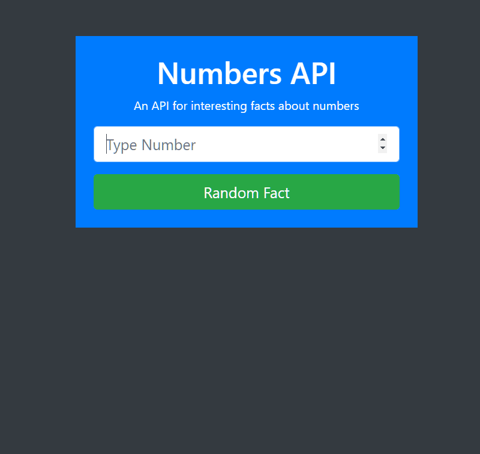

# num-api-ajax

A dynamic HTML, CSS, and JavaScript solo project.
Updated version of my old [Chucknorris] API project with better practices. Enjoy!

## About this app
A web application for those who want to look at interesting facts about numbers

## User features
- User can search for a number.
- User can view a random fact based from search.
- User can generate a random fact without a search.
- User can view a fact.

## Preview

## [Live](https://do-jonathan4.github.io/num-api-ajax/)
